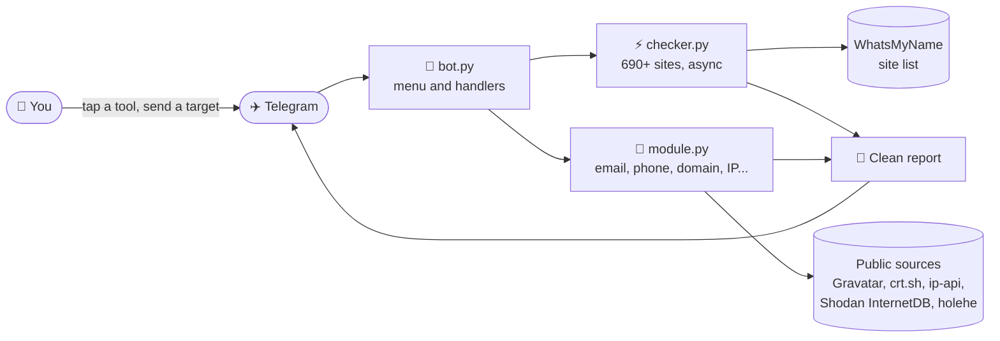

<div align="center">


<a href="#-features">
  
</a>

<br/>


<br/>


<br/><br/>

**A private Telegram bot that gathers _public_ information about a username, email, phone number, name, domain, IP address or Telegram account, and returns clean reports with quick-open buttons.**

<sub>No slash commands to remember. Tap a tool, send the target, get the report.</sub>

</div>

<br/>

> [!WARNING]
> **Use responsibly.** This bot only uses public data. Use it on yourself or with the person's permission. You are responsible for how you use it.

---

## 📑 Contents

[✨ Features](#-features) · [👀 Preview](#-preview) · [⚙️ How it works](#️-how-it-works) · [🚀 Quick start](#-quick-start) · [☁️ Deploy on Render](#️-deploy-on-render-free) · [🛠 Troubleshooting](#-troubleshooting) · [📁 Structure](#-project-structure) · [⚠️ Limits](#️-limitations)

---

## ✨ Features

| | Tool | What it does | Time |
|:-:|---|---|:-:|
| 👤 | **Username** | Checks one username on **690+ sites at once** and lists the profiles that exist, grouped by category. The full list also comes as a `.txt` file. | 20-60 s |
| 📧 | **Email** | Mail server check, public Gravatar profile, **100+ sites** where the email is registered ([holehe](https://github.com/megadose/holehe)), and known breaches. | 1-2 min |
| 💥 | **Breach** | Shows which known data leaks an email appeared in. Never shows passwords. | 5-10 s |
| 📱 | **Phone** | Validity, country, region, carrier, line type, timezone, and quick links to WhatsApp, Telegram, Truecaller and Google. | instant |
| 🧑 | **Name** | Builds likely usernames and opens ready-made searches on Google, LinkedIn, Facebook, Instagram, X, GitHub and Telegram. | instant |
| 🌐 | **Domain** | WHOIS, DNS records, SPF/DMARC check and subdomains from certificate logs. | 10-30 s |
| 📡 | **IP** | Approximate location, ISP, VPN/hosting flags and open ports. | 3-5 s |
| ✈️ | **Telegram** | Reads a public `t.me` profile: name, bio, type and photo. | 2-3 s |
| 🕵️ | **Dorks** | Builds advanced Google searches for any text and opens them in one tap. | instant |
| 🖼 | **Image** | Photo → reverse-search links. Image as **File** → EXIF: camera, date and GPS with a map button. | 2-5 s |
| ↪️ | **Forward** | Forward any message to see the sender's ID, name and username. | instant |
| ⚡ | **Auto** | Send anything and the bot detects what it is, then offers the right scans. | instant |

<details>
<summary><b>🎁 Also included</b></summary>

<br/>

- 🔘 Permanent button menu under the text box
- ❓ Built-in **Help center** that explains every tool with examples
- 🔒 **Owner-only**: nobody else can use your bot
- ✂️ Long results are split safely and attached as files when needed
- 🔁 One-tap follow-ups, for example scan the username found in an email
- ⚡ **Run everything**: runs all scans for the detected target

</details>

### 🔗 Services the bot opens for you

<p align="center">
  &nbsp;&nbsp;
  &nbsp;&nbsp;
  &nbsp;&nbsp;
  &nbsp;&nbsp;
  &nbsp;&nbsp;
  &nbsp;&nbsp;
  
</p>

---

## 👀 Preview

**The menu** (always visible under the text box)

```text
 ┌────────────┬────────────┬────────────┐
 │ 👤 Username │ 📧 Email    │ 📱 Phone    │
 ├────────────┼────────────┼────────────┤
 │ 🧑 Name     │ 🌐 Domain   │ 📡 IP       │
 ├────────────┼────────────┼────────────┤
 │ ✈️ Telegram │ 💥 Breach   │ 🕵️ Dorks    │
 ├────────────┼────────────┼────────────┤
 │ 🖼 Image    │ ⚡ Auto     │ ❓ Help     │
 └────────────┴────────────┴────────────┘
```

**A report** (illustrative example of the format)

```text
👤 USERNAME SCAN
johndoe
━━━━━━━━━━━━━━━━━━
✅ 34 profiles found
├ Sites checked  693
└ Time  21s

💬 SOCIAL · 12
GitHub · Instagram · X · Reddit · ...

💻 CODING · 6
GitLab · Docker Hub · npm · ...
```

Every report ends with **quick-open buttons** (Google, maps, VirusTotal, WhatsApp and more) and **follow-up scans**.

---

## ⚙️ How it works



- **Async scanning:** the username checker uses `aiohttp` with 50 parallel connections and a timeout per site.
- **Smart detection:** the bot recognises emails, phones, IPs, domains, usernames, names and `t.me` links.
- **Fast EXIF:** only the first 1 MB of an image is downloaded, because EXIF is stored at the start of the file.

---

## 🚀 Quick start

**You need:** Python 3.11+ and a bot token from [@BotFather](https://t.me/BotFather).

```bash
# 1. Create a virtual environment
python -m venv venv
venv\Scripts\activate          # Windows
# source venv/bin/activate     # Linux / macOS

# 2. Install dependencies
pip install -r requirements.txt

# 3. Create your .env file (see below)

# 4. Run
python bot.py
```

Open your bot in Telegram and send `/start`. 🎉

### 🔐 Environment variables

Create a `.env` file next to `bot.py`:

```env
BOT_TOKEN=your token from @BotFather
OWNER_ID=your numeric Telegram ID
DEFAULT_REGION=ET
INCLUDE_ADULT=0
```

| Variable | Required | Description |
|---|:-:|---|
| `BOT_TOKEN` | ✅ | Token from @BotFather |
| `OWNER_ID` | ✅ | Your Telegram user ID (get it from [@userinfobot](https://t.me/userinfobot)). Only this user can use the bot. |
| `DEFAULT_REGION` | | Country code for reading local phone numbers like `0911...` (default `ET`) |
| `INCLUDE_ADULT` | | `1` includes adult sites in username scans, `0` hides them (default `0`) |

> [!CAUTION]
> Never commit your `.env` file or share your bot token. `.env` is already listed in `.gitignore`.

---

## ☁️ Deploy on Render (free)

<p>
  
  
  
</p>

**1.** Push the project to a **private** GitHub repo (without `.env`).

**2.** On [Render](https://render.com): **New → Web Service** and connect the repo.

**3.** Use these settings:

| Field | Value |
|---|---|
| Language | `Python 3` |
| Build Command | `pip install -r requirements.txt` |
| Start Command | `python bot.py` |
| Instance Type | `Free` |

**4.** Add environment variables:

```env
BOT_TOKEN=...
OWNER_ID=...
DEFAULT_REGION=ET
INCLUDE_ADULT=0
PYTHON_VERSION=3.11.9
```

**5.** Deploy and open the **Logs**. You should see:

```text
Health server listening on port 10000
Start polling
Your service is live 🎉
```

**6. Keep it awake 24/7.** Render's free plan sleeps after 15 minutes without traffic. Create a free [UptimeRobot](https://uptimerobot.com) **HTTP(s)** monitor that pings your Render URL every **5 minutes**. The bot serves a tiny health page on `/` and `/health` for this. It only starts when Render provides a `PORT`, so local runs are unchanged.

> [!IMPORTANT]
> Run only **one copy** of the bot per token. If it also runs on your PC or another host, Telegram returns a `Conflict` error.

---

## 🛠 Troubleshooting

| Problem | Fix |
|---|---|
| `Conflict: terminated by other getUpdates request` | Another copy is running with the same token. Stop it, or create a new token with `/revoke` in @BotFather and update `BOT_TOKEN`. |
| Render says **no open ports detected** | Make sure you use the latest `bot.py` with the health server. |
| Bot sleeps or answers slowly after idle | Add the UptimeRobot monitor (step 6). |
| `holehe unavailable` in an email scan | Run `pip install holehe` and set `PYTHON_VERSION=3.11.9` on Render. |
| Image shows no EXIF | Send the image as a **File** (📎 → File). WhatsApp, Instagram and Facebook strip EXIF. |
| Breach or subdomain section shows a warning | The free API is busy. Try again in a minute. |

---

## 📁 Project structure

```text
.
├── bot.py             # Telegram bot: menu, buttons, help center, handlers
├── module.py          # Lookups: email, phone, domain, IP, Telegram, EXIF
├── checker.py         # Async username scanner (aiohttp)
├── requirements.txt   # Python dependencies
├── .env.example       # Environment variable template
└── .gitignore
```

## 🧰 Built with

<p align="center">
  
</p>

| | |
|---|---|
| **[aiogram 3](https://github.com/aiogram/aiogram)** | Telegram bot framework |
| **[aiohttp](https://github.com/aio-libs/aiohttp)** | Async HTTP requests |
| **[WhatsMyName](https://github.com/WebBreacher/WhatsMyName)** | Site list for username checks (refreshed weekly) |
| **[holehe](https://github.com/megadose/holehe)** | Email registration checks |
| **[phonenumbers](https://github.com/daviddrysdale/python-phonenumbers)** | Phone number parsing |
| **dnspython · python-whois · Pillow** | DNS, WHOIS and EXIF reading |
| **Free public APIs** | Gravatar, XposedOrNot, crt.sh, ip-api, Shodan InternetDB |

---

## ⚠️ Limitations

- Results are **leads, not proof**. Always confirm before drawing conclusions.
- Username scans can include false positives, and common names match many people.
- The phone tool cannot reveal the owner's name.
- IP location is usually the ISP's hub, not an exact address.
- Free APIs can be slow or rate-limited.
- On Render's free plan the instance is small, so email scans can take 1-2 minutes.

## 🔒 Privacy & responsible use

- Only publicly available information is used.
- The bot is locked to a single owner ID.
- Do not use it for stalking, harassment or any illegal activity.

<br/>

<div align="center">

**Built with ❤️ and Python**

<sub>If this project helps you, give it a ⭐</sub>


</div>